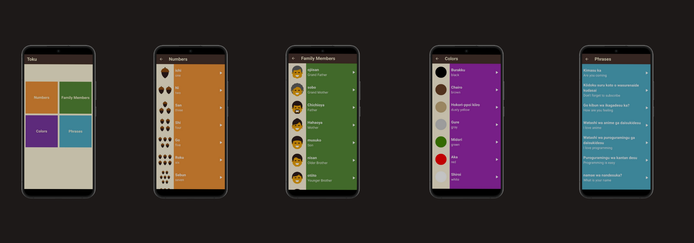
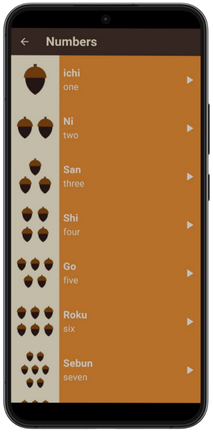
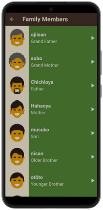
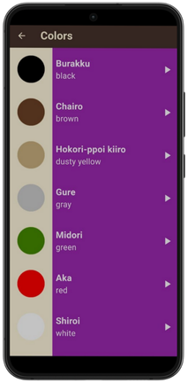
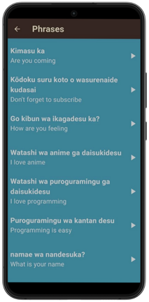

# 📱 Toku - Learn Japanese

🌟 Overview

- A modern language app to help users learn basic Japanese vocabulary and expressions through categorized lessons:

✨ Numbers, Colors, Family Members, and Common Phrases  
🎌 Japanese-to-English translations  
🔊 Audio pronunciation for immersive learning  

<p align="center">
  
</p>

---

## 🎨 Views

🏠 1. Home View:
- Welcomes users to Toku, the Japanese learning app 🇯🇵.
- Displays four main learning categories — Numbers 🔢, Family Members 👨‍👩‍👧, Colors 🎨, and Phrases 💬.
- Each colorful tile leads to its dedicated section for focused learning.
- Acts as the main navigation hub of the app.


<p align="left">
  
</p>

##

🔢 2. Numbers View:
- Introduces users to Japanese numbers through visuals and sound.
- Each list item shows the Japanese word, English translation, and an illustrative image 🥜.
- Includes an audio play button 🔊 to hear pronunciation.
- Uses a warm orange theme to represent energy and focus.

<p align="left">
  
</p>

##

👨‍👩‍👧 3. Family Members View:
- Teaches Japanese vocabulary for family relationships.
- Each list item displays a friendly avatar 👱‍♂️, Japanese term, and English equivalent.
- Includes audio playback 🎧 for pronunciation practice.
- The green theme symbolizes connection and family bonds.
  
<p align="left">
  
</p>

##

🎨 4. Colors View:
- Helps users learn Japanese color names in an interactive way.
- Each item shows a color swatch, Japanese name, and English translation.
- Tapping the audio icon 🔈 plays the correct pronunciation.
 - The purple theme represents creativity and visual expression.


<p align="left">
  
</p>

##

💬 5. Phrases View:
- Provides users with useful Japanese phrases for everyday conversation.
- Each tile shows a Japanese phrase, its English meaning, and a play icon ▶️ for listening practice.
- Focuses on real-world dialogue and pronunciation improvement.
- The blue theme creates a calm and clear learning experience.


<p align="left">
  
</p>


## 🛠️ Tech Stack

📱 **Frontend**  
- Flutter 


## 🏗️ Project Architecture

```
lib/
│
├── core/
│   ├── functions/           # Common helper functions (e.g., build_app_bar.dart)
│   ├── models/              # Shared data models (e.g., item_model.dart)
│   ├── utils/               # App-wide utilities (e.g., colors_manager.dart, app_router.dart)
│   └── widgets/             # Shared/reusable widgets (e.g., list_item.dart)
│
├── features/
│   ├── home/
│   │   ├── presentation/
│   │   │   ├── views/       # Home screen views (e.g., home_view.dart)
│   │   │   └── widgets/     # Home-specific widgets (e.g., home_view_body.dart, custom_grid_view_item.dart)
│   │   └── ...              # (Add data/domain layers if needed)
│   │
│   ├── numbers/
│   │   ├── presentation/
│   │   │   ├── views/       # Numbers screen views (e.g., numbers_view.dart)
│   │   │   └── widgets/     # Numbers-specific widgets (e.g., numbers_view_body.dart)
│   │   └── ...              # (Add data/domain layers if needed)
│   │
│   ├── family_members/
│   │   ├── presentation/
│   │   │   ├── views/
│   │   │   └── widgets/
│   │   └── ...
│   │
│   ├── colors/
│   │   ├── presentation/
│   │   │   ├── views/
│   │   │   └── widgets/
│   │   └── ...
│   │
│   └── phrases/
│       ├── presentation/
│       │   ├── views/
│       │   └── widgets/
│       └── ...
│
├── main.dart                # App entry point
│
└── ...
```

**Key Points:**
- **core/**: Common utilities and widgets used across features.
- **features/**: Each feature is isolated with its own data and presentation layers.
- **presentation/views/**: Screens/pages.
- **presentation/widgets/**: UI components for each feature.
- **assets/**: Static resources.

This structure is scalable and easy to maintain as your app grows.


