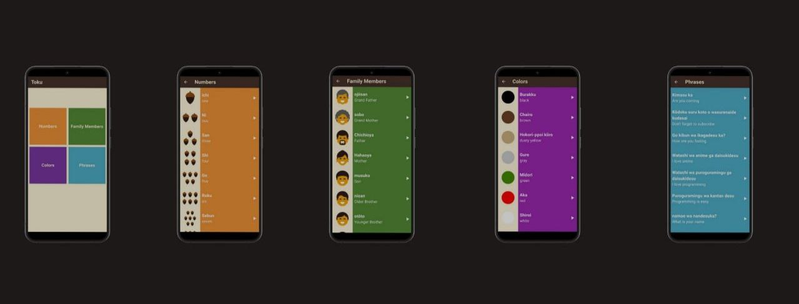
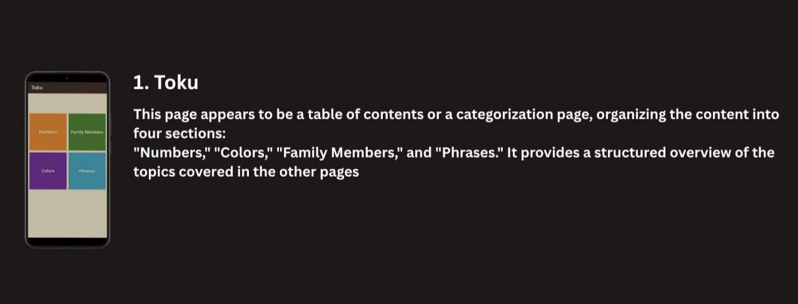
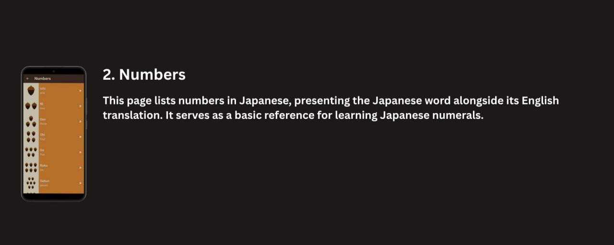
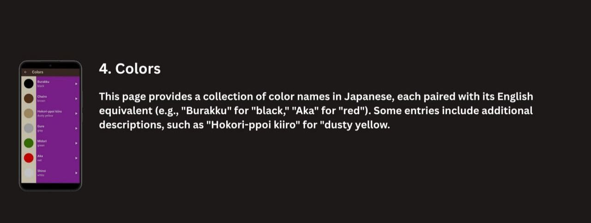
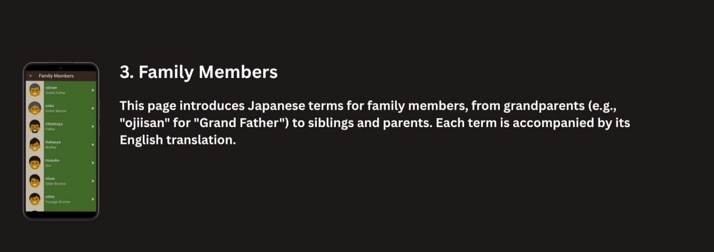

# 📱 Toku - Learn Japanese

A modern Flutter app to help users learn basic Japanese vocabulary and expressions through categorized lessons:

✨ Numbers, Colors, Family Members, and Common Phrases  
🎌 Japanese-to-English translations  
🔊 Audio pronunciation for immersive learning  

<p align="center">
  
</p>

---

## 🧩 Views & Features


### 📚 Toku (Home View)  
A categorized overview screen, offering access to:
- Numbers
- Colors
- Family Members
- Phrases

<p align="center">
  
</p>

### 🔢 Numbers  
This screen lists Japanese numbers with English translations.  
Examples:  
- *Ichi* → "One"  
- *Ni* → "Two"  

<p align="center">
  
</p>

---

### 🎨 Colors  
This view introduces colors in Japanese alongside their English counterparts.  
Examples:  
- *Burakku* → "Black"  
- *Aka* → "Red"  
- *Hokori-ppoi kiiro* → "Dusty Yellow"  

<p align="center">
  
</p>

---

### 👪 Family Members  
Learn essential family-related vocabulary in Japanese.  
Examples:  
- *Ojiisan* → "Grand Father"  
- *Hahaoya* → "Mother"  
- *Ani* → "Older Brother"  

<p align="center">
  
</p>

---

### 💬 Phrases  
Common Japanese phrases with English translations for daily conversations.  
Examples:  
- *Kimasu ka* → "Are you coming?"  
- *Watashi wa anime ga daisukidesu* → "I love anime"  

<p align="center">
  
</p>

---

## 🛠️ Tech Stack

📱 **Frontend**  
- Flutter 
- GoRouter  

🎨 **Design**  
- Custom reusable widgets  
- Minimalist educational UI  

📦 **Dependencies** 
- `audioplayers`  
- `flutter_staggered_animations`   

---

## 🏗️ Project Architecture

```
lib/
│
├── core/
│   ├── functions/           # Common helper functions (e.g., build_app_bar.dart)
│   ├── models/              # Shared data models (e.g., item_model.dart)
│   ├── utils/               # App-wide utilities (e.g., colors_manager.dart, app_router.dart)
│   └── widgets/             # Shared/reusable widgets (e.g., list_item.dart)
│
├── features/
│   ├── home/
│   │   ├── presentation/
│   │   │   ├── views/       # Home screen views (e.g., home_view.dart)
│   │   │   └── widgets/     # Home-specific widgets (e.g., home_view_body.dart, custom_grid_view_item.dart)
│   │   └── ...              # (Add data/domain layers if needed)
│   │
│   ├── numbers/
│   │   ├── presentation/
│   │   │   ├── views/       # Numbers screen views (e.g., numbers_view.dart)
│   │   │   └── widgets/     # Numbers-specific widgets (e.g., numbers_view_body.dart)
│   │   └── ...              # (Add data/domain layers if needed)
│   │
│   ├── family_members/
│   │   ├── presentation/
│   │   │   ├── views/
│   │   │   └── widgets/
│   │   └── ...
│   │
│   ├── colors/
│   │   ├── presentation/
│   │   │   ├── views/
│   │   │   └── widgets/
│   │   └── ...
│   │
│   └── phrases/
│       ├── presentation/
│       │   ├── views/
│       │   └── widgets/
│       └── ...
│
├── main.dart                # App entry point
│
└── ...
```

**Key Points:**
- **core/**: Common utilities and widgets used across features.
- **features/**: Each feature is isolated with its own data and presentation layers.
- **presentation/views/**: Screens/pages.
- **presentation/widgets/**: UI components for each feature.
- **assets/**: Static resources.

This structure is scalable and easy to maintain as your app grows.


